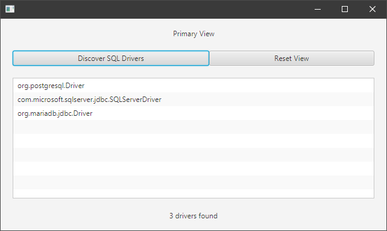

# Demo how to create JavaFX app with custom runtime image using SPI drivers such as JDBC drivers

The only purpose of this project is to investigate, how to properly configure a JavaFX project
using Maven and the JavaFX Maven plugin. The interesting point is, how to properly link JDBC
drivers in a customized runtime?

## Boundary conditions

* JavaFX 15
* modular project, so all classes moved to module path
* Maven as build tool
* Javafx-maven-plugin
* Uses some SPI modules from: Microsoft SqlServer JDBC driver, MariaDB JDBC driver and PostgreSQL JDBC driver

## Problem

When running the POM.XML without explicit configuration of `--module-path` in `javafx-maven-plugin`,
the JDBC drivers are not found when running the image built using `mvn javafx:jlink`. On the other hand
when executing `mvn javafx:run`, everything works as expected, the JDBC drivers are detected.

## Doesnt work as expected when using `mvn javafx:jlink`:

```XML

<plugin>
	<groupId>org.openjfx</groupId>
	<artifactId>javafx-maven-plugin</artifactId>
	<version>0.0.5</version>
	<configuration>
	<stripDebug>true</stripDebug>
	<compress>2</compress>
	<noHeaderFiles>true</noHeaderFiles>
	<noManPages>true</noManPages>
	<launcher>demoapp</launcher>
	<jlinkImageName>hello</jlinkImageName>
	<jlinkZipName>hellozip</jlinkZipName>
	<mainClass>net.raumzeitfalle.demoapp/playground.javafx.ModularSpiDemo</mainClass>
	<runtimePathOption>MODULEPATH</runtimePathOption>
	</configuration>
</plugin>

```

## Works! Yay!

As a workaround, one can use the `maven-dependency-plugin` to copy all dependencies to a certain location.
So when before JLink is called, a copy task is executed and later Jlink can use the specified directory
as module path.

```XML

<plugin>
	<groupId>org.openjfx</groupId>
	<artifactId>javafx-maven-plugin</artifactId>
	<version>0.0.5</version>
	<configuration>
		<stripDebug>true</stripDebug>
		<compress>2</compress>
		<noHeaderFiles>true</noHeaderFiles>
		<noManPages>true</noManPages>
		<launcher>demoapp</launcher>
		<jlinkImageName>hello</jlinkImageName>
		<jlinkZipName>hellozip</jlinkZipName>
		<mainClass>net.raumzeitfalle.demoapp/playground.javafx.ModularSpiDemo</mainClass>
		<runtimePathOption>MODULEPATH</runtimePathOption>
		<options>
			<option>--module-path</option>
			<option>${project.build.directory}/modulepath</option>
		</options>
	</configuration>
</plugin>

<plugin>
	<groupId>org.apache.maven.plugins</groupId>
	<artifactId>maven-dependency-plugin</artifactId>
	<version>3.1.2</version>
	<executions>
		<execution>
			<id>copy-dependencies</id>
				<phase>prepare-package</phase>
			<goals>
				<goal>copy-dependencies</goal>
			</goals>
			<configuration>
				<outputDirectory>${project.build.directory}/modulepath</outputDirectory>
				<overWriteReleases>false</overWriteReleases>
				<overWriteSnapshots>false</overWriteSnapshots>
				<overWriteIfNewer>true</overWriteIfNewer>
			</configuration>
		</execution>
	</executions>
</plugin>

```

## How to run the project

```cmd

> mvn javafx:run

```

## How to create a runtime-image

The resulting runtime image won't be able to detect any JDBC drivers.

```cmd

> mvn javafx:jlink

```

Alternatively, one could run the following line. The resulting runtime image will detect the JDBC drivers.

```cmd

> mvn package javafx:jlink

```

Well, somehoe this does not feel correct yet, but certainly I'll have to do more work to gain better 
understanding of what Maven does here. It becomes possibly helpful but definitively interesting,
when running the Maven process with an increased verbosity.

```cmd
> mvn -X package javafx:jlink

```


## Executing the runtime-image

The runtime image can be started then using:


```cmd

> target\ModularSpiDemo\bin\Demo.bat

```

 

